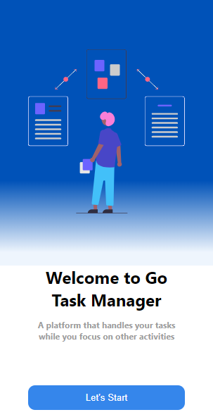
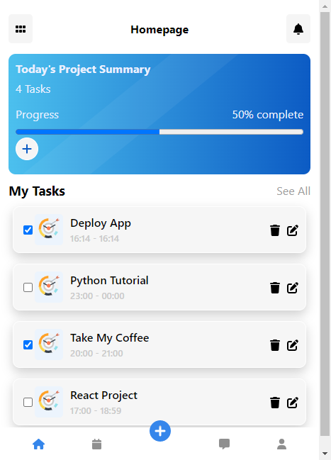
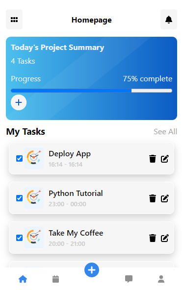

# Go Task Manager App

This repo contains files for a user friendly and interactive CRUD web application I developed for Personal Task Management. On this app user can manage and schedule their tasks. It also has feature to sort complete and incomplete tasks.

DEMO
==========
Check out the demo on my Codepen https://dimlaw7.github.io/Go-Task-Manager/

Snap Shots
===================================

   

# Documentation

This project was bootstrapped with [Create React App](https://github.com/facebook/create-react-app).
